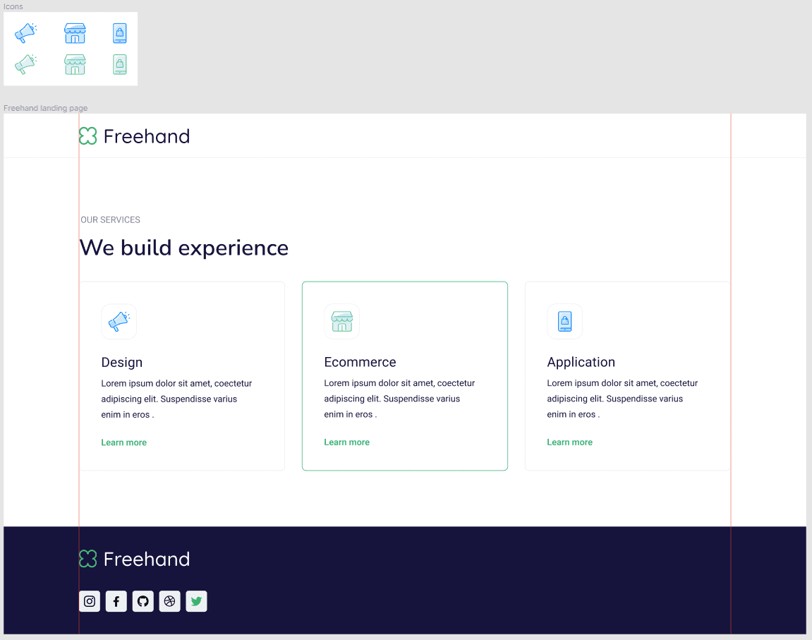

# BeetRootEducation

_LMS Beetroot Academy progress_

## ДОМАШНЄ ЗАВДАННЯ

**Обов'язково:**

- Зверстати макет — [Freehand](https://www.figma.com/file/X5pUiuIm5iIGsG34XntSOy/SVG---Freehand-landing)

> Секція Services - **вставити SVG код прямо в элемент**, додати hover state.
>
> Footer - `вставити **іконки використовуючи SVG спрайт**, додати hover state.

**Екстра:**

- Практикуємо у створенні SVG вручну.

> Створи всі SVG-зображення - [посилання.](https://lms.beetroot.academy:3005/bafile/fd9c0623-37fb-4fe4-bd8d-fe84a633a420.zip?bearer=eyJhbGciOiJIUzI1NiIsInR5cCI6IkpXVCJ9.eyJieCI6dHJ1ZSwiYnhzIjp0cnVlLCJ1c2VyTmFtZSI6IlNlcmhpaSBNeXNoa28iLCJ1c2VyIjp7ImlkIjoiY2w4ajE5bmdmMXBiMTA3MjcwZGhhN3RsayIsInVzZXJOYW1lIjoiU2VyaGlpIE15c2hrbyIsImVtYWlsIjoic2VyZ2Vpb3duQGdtYWlsLmNvbSIsImFjdGl2YXRlZCI6dHJ1ZSwiaXNHZHByIjp0cnVlLCJ0ZXJtT2ZVc2UiOnRydWUsInJvbGVzIjpbIlJPTEVfU1RVREVOVCJdLCJhdmF0YXIiOiI5MmE5YTkwMS1hMzAzLTQwYzEtYTU3NC05ODRkZGEyOWRlMWYuanBnIiwicHJvZmlsZSI6eyJhdmF0YXIiOnsicGF0aCI6IjkyYTlhOTAxLWEzMDMtNDBjMS1hNTc0LTk4NGRkYTI5ZGUxZi5qcGcifX0sImNpdHkiOnsiaWQiOiJjanhxZm11cHkwMDB6MDgzNmZlMm5ncGlnIiwibmFtZSI6ItCa0LjRl9CyIn19LCJpYXQiOjE2NjgwNzkxMjksImV4cCI6MTY2ODY4MzkyOX0.zQ3ZeQSU9fiwFiHy5G4dxYcvaWIZ1L20J9-mz3wi-5k)

